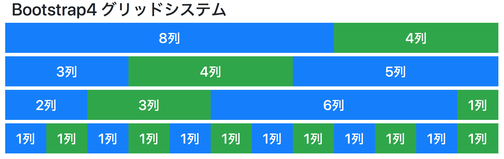
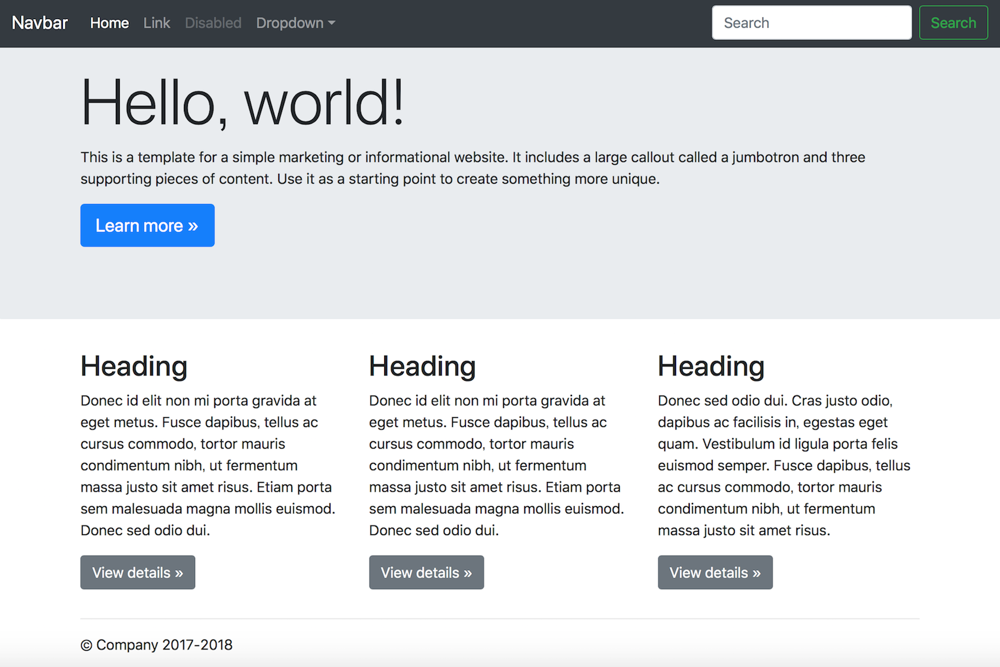

# Bootstrap4

とはなんでしょう

Note:
このレクチャーではBootstrap4とは何かについてお話しします。
+++

人気の
## CSSフレームワーク

Note:
Bootstrap4は人気のCSSフレームワークです。

+++

CSSフレームワークとは？

Note:
CSSフレームワークとは何かお分かりでしょうか？

+++

CSSフレームワークは

CSSの書式指定を集めたライブラリー集

Note:
CSSフレームワークはCSSの書式指定を集めたライブラリー集です。

+++

CSSフレームワークを利用すると、

自分でCSSを記述しなくても、

用意されたclass属性を指定するだけで、

見た目のよいWebサイトを構築できる

Note:
CSSフレームワークを利用すると、自分でCSSを記述しなくても、用意されたclassを指定するだけで、見た目のよいWebサイトを構築できます。

+++

次は、Bootstrap4の特徴
Note:
次はBootstrap4の特徴についてご説明します。
---

Bootstrap4

# 3つの特徴

Note:
Bootstrap4の特徴について3点お話しします。

+++

特徴その1

# レスポンシブWebデザイン

Note:
特徴その１はレスポンシブWebデザインです。
+++

レスポンシブWebデザイン?

Note:
レスポンシブWebデザインとは何かお分かりでしょうか？
+++

レスポンシブWebデザインとは

ひとつのHTMLでサイト閲覧者のデバイスの画面サイズに応じて最適な画面のレイアウトを表示させる技術のこと

Note:
レスポンシブWebデザインとは、ひとつのHTMLで、サイト閲覧者のデバイスの画面サイズに応じて、最適な画面のレイアウトを表示させる技術のことを言います。

+++

レスポンシブWebデザインのデモ

[Themewagon Live Demo (HTML5 & Bootstrap)](http://demo.themewagon.com/preview/titan)

Note:
レスポンシブWebデザインがよくわかるサイトでご紹介します。Bootstrapで作られたThemewagon Live Demoというサイトですが、画面下のアイコンをクリックすることで、表示するデバイスをシミュレートすることができます。PCでは横に長く表示された画面上部のメニューがスマートフォンでは、メニューのハンバーガーアイコンのみに置きかわりクリックすることで縦長にメニューが表示されるよう工夫されています。レスポンシブWebデザインの特徴がよくわかるサイトです。

+++

特徴その2

# グリッドシステム

Note:
特徴その2はグリッドシステムです。

+++

グリッドシステムとは

ページ全体を横幅12分割で構成する仕組みのこと

Note:
Bootstrap4のグリッドシステムとは、ページ全体を横幅12分割で構成する仕組みのことです。

+++

「各コンテンツが何列分の幅を使用するか？」を指定すると

## ページ全体のレイアウトを自由に組み立てられる

Note:
「各コンテンツが何列分の幅を使用するか？」を指定すると、ページ全体のレイアウトを自由に組み立てられます。

+++

特徴その3

# 豊富なコンポーネント群

Note:
特徴その3は豊富なコンポーネント群です。

+++

Bootstrap4に用意されている豊富なコンポーネントを使用することで、見栄えのいいWebページを効率よく作成することができる。

Note:
Bootstrap4に用意されている豊富なコンポーネントを使用することで、見栄えのいいWebページを効率よく作成することができます。

